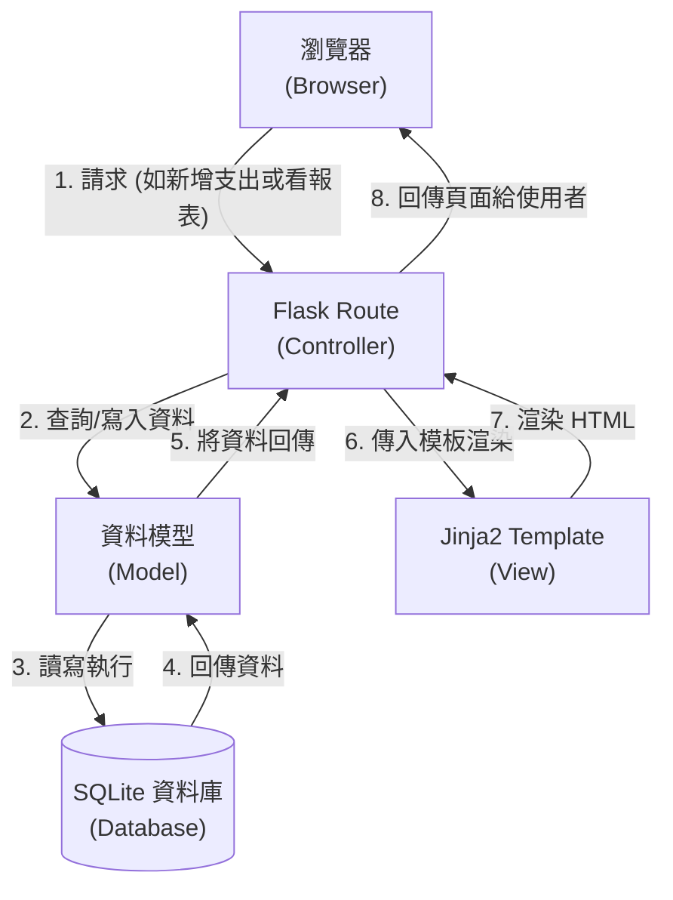

# 系統架構文件 (Architecture) - 個人記帳簿系統

## 1. 技術架構說明

根據 PRD 提出的需求與技術限制，我們選擇以下技術組合：

- **後端框架：Python + Flask**
  - **原因**：Flask 相較於 Django 更為輕量與彈性，非常適合用來開發這類功能集中且單純的個人記帳簿系統。
- **模板引擎：Jinja2**
  - **原因**：Jinja2 與 Flask 高度整合，能直接將後端資料無縫嵌入前端 HTML 中，有效降低開發複雜度。不需要建置前後端分離架構，所有頁面直接在伺服器渲染回傳。
- **資料庫：SQLite**
  - **原因**：這是一個「零配置」的關聯式資料庫，所有資料都儲存在單一檔案中，無需額外安裝或管理龐大的資料庫伺服器（如 MySQL 或 PostgreSQL），非常適合單機版或個人的網頁應用程式。

### Flask MVC 模式說明
雖然 Flask 不像某些框架有嚴格的 MVC (Model-View-Controller) 規定，但我們依舊會採用類似概念來分類程式碼：
- **Model (資料模型)**：負責與 SQLite 資料庫溝通，定義「收入 (Income)」跟「支出 (Expense)」這些資料表記錄，並撰寫新增、修改、刪除的方法。
- **View (視圖)**：負責呈現使用者見到的 UI 介面，在系統中就是由 **Jinja2** 組裝並渲染的 HTML 檔案。
- **Controller (控制器)**：負責接收網頁請求與商業邏輯，在系統中就是 **Flask 的 Routes (路由)**。它會接收來自瀏覽器的操作（如：「新增一筆晚餐支出」），並指揮 Model 將結果儲存，最後選擇對應的 Jinja2 Template (View) 來顯示結果給使用者。

---

## 2. 專案資料夾結構

保持架構簡潔且易於擴充，我們規劃了如下資料夾結構：

```text
web_app_development/
├── app/
│   ├── models/           ← (Model) 資料庫模型：定義資料表與資料存取邏輯
│   ├── routes/           ← (Controller) Flask 路由：處理各個頁面的請求
│   ├── templates/        ← (View) Jinja2 HTML 模板：畫面呈現 (如 Base 共用版型)
│   └── static/           ← CSS / JS 靜態資源：例如自定義的樣式表或圖表的 JS
├── instance/
│   └── database.db       ← SQLite 資料庫檔案：系統自動產生，存放實際記帳資料
├── docs/                 
│   ├── PRD.md            ← 產品需求文件
│   └── ARCHITECTURE.md   ← 系統架構文件 (本檔案)
├── app.py                ← 應用程式入口點：負責啟動 Flask 伺服器並註冊各路由
└── requirements.txt      ← 專案依賴套件表：記錄需要的模組清單
```

---

## 3. 元件關係圖

以下是用以表示使用者在操作記帳系統時，各元件如何互相配合的流程關係：



---

## 4. 關鍵設計決策

1. **採用單體式與伺服器端渲染 (SSR)**  
   - *原因*：為了加速開發並符合不需前後端分離的限制，我們選擇將所有的畫面依賴 Jinja2 渲染完成。相較於架設一套 React/Vue 的架構，這種方式不必花時間設計複雜的 JSON API，能讓我們將重點集中在核心財務紀錄功能。

2. **目錄模組化設計 (`app/models` 與 `app/routes`)**  
   - *原因*：雖然這是一個 MVP 小型系統，但提早將路由與資料庫模型進行拆分，不僅能避免 `app.py` 變得過於龐大，如果未來要擴增新的圖表功能 (Nice to Have) 或資料匯出功能，也能保持優良的維護性。

3. **每月固定扣款的簡化實作**  
   - *原因*：PRD 中有提到「每月固定扣款」(Should Have) 功能。初期的 MVP 設計可由後端邏輯判斷是否跨月並「自動在背景新增記錄」，而非導入 Celery 等複雜的背景定期任務佇列，如此一來既能確保功能實作也維持了架構的輕量。

4. **採用關聯式資料庫架構**  
   - *原因*：財務記帳系統的特徵在於有明確且規律的資料屬性，例如：分類、金額、日期等。故比起 NoSQL，使用關聯式體系的 SQLite 能帶來更好的資料一致性限制，若之後系統要向外擴展 (Scale up)，轉換至 PostgreSQL 的門檻也會較低。
