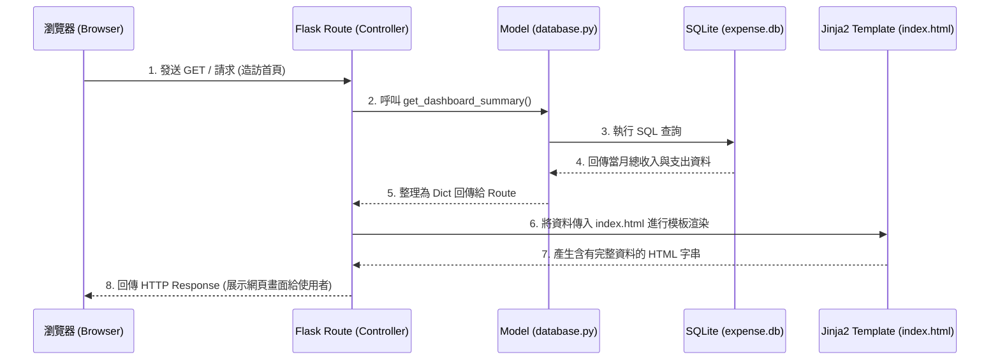

# 系統架構文件 (Architecture)

## 專案名稱：個人記帳簿 (Personal Expense Tracker)

### 1. 技術架構說明
- **選用技術與原因**：
  - **後端 (Python + Flask)**：Flask 是一個輕量級且靈活的 Web 框架，非常適合快速構建 MVP 與中小型應用。Python 生態系豐富且語法簡潔，能大幅提升開發效率。
  - **視圖渲染 (Jinja2)**：與 Flask 深度整合，讓伺服器端能夠在回傳 HTML 前動態填入資料，不需要額外維護一套複雜的前後端分離架構，降低初期開發門檻。
  - **資料庫 (SQLite)**：內建於 Python 環境的檔案型資料庫，無需額外建立或維護資料庫伺服器（如 MySQL 或 PostgreSQL）。對於輕量級記帳系統而言，效能已非常足夠，且易於備份與轉移。
  - **前端樣式 (Vanilla CSS + HTML5)**：直接使用純 CSS 搭配 HTML5 控制版面，確保專案輕量並達成響應式設計 (RWD)。圖表渲染部分可考慮引入輕量級 JS 函式庫 (如 Chart.js)。

- **Flask MVC 模式說明**：
  - **Model (模型)**：負責定義資料表結構（Schema）並與 SQLite 進行互動。封裝了與資料庫溝通的相關羅輯（如當月總收支計算、單筆紀錄的新增刪除）。
  - **View (視圖)**：Jinja2 樣板檔案 (`.html`)，負責決定使用者在瀏覽器上看到的畫面樣貌，包含變數的顯示與邏輯分頁。
  - **Controller (控制器/路由)**：Flask 中的路由功能（Route），負責接收瀏覽器傳來的要求（Request）、向 Model 請求必要資料，最後把資料拋給 View 進行渲染拼裝，再回傳給使用者（Response）。

---

### 2. 專案資料夾結構

本專案依照關注點分離 (Separation of Concerns) 的原則，將程式目錄架構規劃如下：

```text
web_app_development/
├── app/
│   ├── __init__.py      ← 初始化 Flask 應用程式、載入設定
│   ├── models/          ← 資料庫模型目錄 (MVC 的 M)
│   │   ├── __init__.py
│   │   └── database.py  ← 資料庫連線處理、Schema 定義與所有 CRUD 查詢函式
│   ├── routes/          ← 路由目錄 (MVC 的 C)
│   │   ├── __init__.py
│   │   ├── index.py     ← 首頁總覽 (Dashboard) 的路由邏輯
│   │   └── expense.py   ← 新增/修改/刪除記帳紀錄的路由邏輯
│   ├── templates/       ← HTML 模板目錄 (MVC 的 V)
│   │   ├── base.html    ← 共用的版面 (如 Navbar 頭部、尾部)
│   │   ├── index.html   ← 首頁總覽頁面 (顯示財務總覽、統計圖表)
│   │   └── expense.html ← 記帳紀錄表單頁面
│   └── static/          ← 靜態資源檔案
│       ├── css/
│       │   └── style.css← 共用的樣式定義
│       └── js/
│           └── main.js  ← 前端互動邏輯 (如表單驗證、圖表繪製)
├── instance/
│   └── expense.db       ← SQLite 資料庫檔案 (運作時將動態產生)
├── docs/                ← 專案文件 (包含 PRD.md, ARCHITECTURE.md 等)
├── .gitignore           ← 忽略加入版本控制的檔案清單
└── app.py               ← 專案啟動入口程式，負責執行 Server
```

---

### 3. 元件關係圖

以下展示了系統核心處理「取得當月財務總覽」的要求時，各元件如何進行互動：



---

### 4. 關鍵設計決策

1. **選擇 Server-Side Rendering (SSR) 單體式架構**
   - **決策**：網頁畫面將由 Jinja2 在伺服器端渲染完成後，以完整 HTML 回傳給瀏覽器，而非採用前端框架 (SPA) 來抓取 API。
   - **原因**：初期專案的主要功能為 CRUD 展示，重視開發效率與展示可行性（MVP）。此架構能免去前端 API 狀態管理的負擔，開發起來最迅速。
2. **選用輕量級 SQLite 資料庫**
   - **決策**：直接使用檔案型 SQLite，不建置額外的 MySQL 伺服器。
   - **原因**：個人記帳系統的使用者只有單人，也不具有複雜的多人寫入衝突，且可有效減少開發環境的配置複雜度。後續若需要升級也能輕鬆轉移。
3. **模組化的路由結構設計 (Modular Routing)**
   - **決策**：引入 Blueprint 或是把路由打散到 `routes/` 資料夾，不將所有邏輯全寫在 `app.py` 內。
   - **原因**：由於系統有許多潛在功能 (如收支紀錄、分類管理、圖表分析)，拆分資料夾可預防單一檔案落落長；若未來要增加「預算追蹤設定」，可直接在 `routes` 理增添 `budget.py`，保持系統擴充性。
