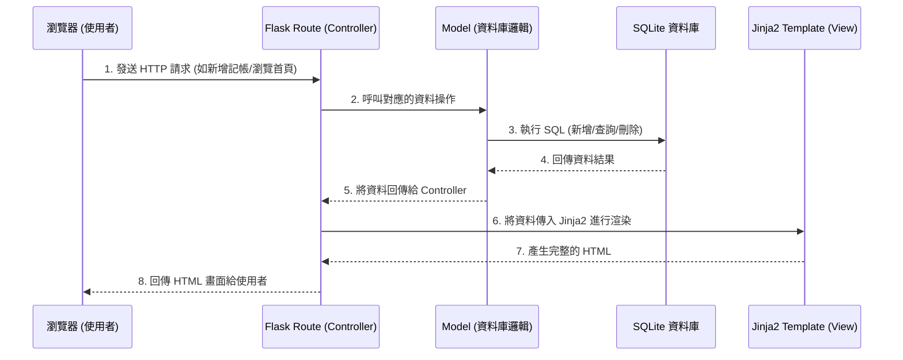

# 系統架構文件 (Architecture)

## 1. 技術架構說明

本系統為「個人記帳簿系統」，主要採用以下技術堆疊來建立輕量級的網頁應用程式：

- **後端框架：Python + Flask**
  - **原因**：Flask 是一個輕量且彈性的 Python 網頁框架，非常適合用於開發中小型專案或 MVP。它能快速建立路由並處理 HTTP 請求。
  - **MVC 模式應用**：
    - **Controller (路由與邏輯)**：由 Flask 的 `@app.route` 負責接收使用者的請求，驗證資料（如記帳金額、日期），並呼叫 Model 進行處理。
    - **Model (資料庫邏輯)**：負責與 SQLite 資料庫互動，執行新增、查詢、刪除等操作。
    - **View (視圖)**：由 Jinja2 模板引擎負責將資料渲染成 HTML 網頁回傳給使用者。

- **模板引擎：Jinja2**
  - **原因**：內建於 Flask 中，能無縫整合 Python 變數與 HTML。由於本專案不採用前後端分離，所有頁面皆由後端渲染後直接回傳給瀏覽器。

- **資料庫：SQLite**
  - **原因**：輕量級的關聯式資料庫，無需額外安裝伺服器軟體，資料以單一檔案儲存，非常適合個人單機或輕度連線使用的記帳系統。

## 2. 專案資料夾結構

以下為建議的專案目錄與檔案結構：

```text
web_app_development/
├── app/
│   ├── __init__.py      # Flask 應用程式工廠與初始化設定
│   ├── models.py        # 資料庫模型 (定義收支紀錄等 Schema)
│   ├── routes.py        # 路由與 Controller 邏輯 (處理收支的新增、刪除、列表)
│   ├── templates/       # Jinja2 HTML 模板 (View)
│   │   ├── base.html    # 共用版型 (包含導覽列、頁尾等)
│   │   └── index.html   # 首頁與記帳列表、餘額顯示
│   └── static/          # 靜態資源檔案
│       ├── css/
│       │   └── style.css # 自訂樣式表
│       └── js/
│           └── main.js  # 前端互動邏輯 (如有需要)
├── instance/
│   └── database.db      # SQLite 資料庫檔案 (執行時自動產生)
├── docs/                # 專案文件 (包含 PRD, 架構文件等)
├── requirements.txt     # Python 依賴套件清單
└── run.py               # 應用程式啟動入口
```

## 3. 元件關係圖

以下圖示說明了使用者從瀏覽器發送請求後，系統內部各元件的互動流程：



## 4. 關鍵設計決策

1. **採用 Server-Side Rendering (SSR) 而非前後端分離**
   - **原因**：為了快速開發 MVP 並降低架構複雜度。直接使用 Flask + Jinja2 渲染畫面，免去設定前端框架（如 React/Vue）及跨域請求 (CORS) 的繁瑣步驟，適合核心為 CRUD 的記帳應用。
2. **使用輕量級 SQLite 資料庫**
   - **原因**：專案目標用戶為個人，資料量小且無高併發需求。SQLite 隨開即用，無需建立獨立的資料庫伺服器，部署與備份皆非常容易。
3. **集中式的路由與模型管理**
   - **原因**：由於目前功能較為單一（主要圍繞在收支紀錄），將所有的路由邏輯統一放在 `routes.py`，模型定義在 `models.py`。若未來功能擴充（如加入圖表分析、匯出 CSV），可再考慮重構為 Blueprint 模組化架構。
4. **防範 SQL Injection 的實作方式**
   - **原因**：雖然是個人應用，但仍需考慮安全性與系統穩定性。將透過 ORM (例如 Flask-SQLAlchemy) 或正確的 Parameterized Query 來處理資料庫操作，避免直接字串拼接 SQL 語法，防止異常輸入導致系統崩潰。
