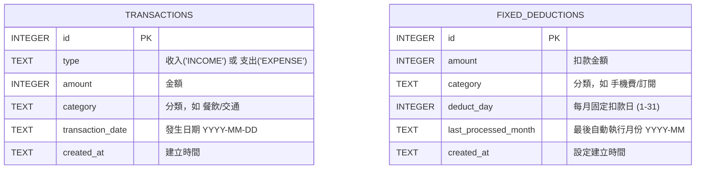

# 資料庫設計文件 (DB Design) - 個人記帳簿系統

本文件根據產品需求與流程規劃，定義了系統後端使用 SQLite 的結構，包含實體關係圖、資料表詳細說明以及對應的 Python Model 設計。

## 1. ER 圖（實體關係圖）

我們將收入與支出合併為 `transactions` 資料表，以類別（type）區分，方便計算總餘額與單一列表呈現。針對每月固定扣款項目則建立 `fixed_deductions`。



---

## 2. 資料表詳細說明

### 2.1 `transactions` (收支紀錄表)
負責儲存所有使用者的日常收付款紀錄，是計算總餘額的核心。

| 欄位名稱 | 型別 | 必填 | 說明 |
| --- | --- | --- | --- |
| `id` | INTEGER | 是 | Primary Key 自動遞增 |
| `type` | TEXT | 是 | 區分此筆帳為 `'INCOME'` (收入) 或 `'EXPENSE'` (支出) |
| `amount` | INTEGER | 是 | 金額，限正整數 |
| `category` | TEXT | 是 | 使用者設定的收支分類，例如「餐飲」、「零用錢」 |
| `transaction_date`| TEXT | 是 | 付款或收款當天的日期，格式為 `YYYY-MM-DD` |
| `created_at` | TEXT | 否 | 資料庫寫入時間，由 `CURRENT_TIMESTAMP` 自動產生 |

### 2.2 `fixed_deductions` (每月固定扣款設定表)
負責登錄使用者預先設定好的每月必扣款項，系統會在後端判斷該月份是否已經產生支出。

| 欄位名稱 | 型別 | 必填 | 說明 |
| --- | --- | --- | --- |
| `id` | INTEGER | 是 | Primary Key 自動遞增 |
| `amount` | INTEGER | 是 | 預設要扣款的金額 |
| `category` | TEXT | 是 | 預設的支出分類 |
| `deduct_day` | INTEGER | 是 | 預設扣款日，範圍 1 到 31 |
| `last_processed_month` | TEXT | 否 | 系統自動扣款後，會更新此欄為該筆已過帳的年月 (如 `2026-04`)，避免重複扣款 |
| `created_at` | TEXT | 否 | 設定項的建立時間 |

---

## 3. SQL 建表語法

請參考本專案下的 `database/schema.sql` 檔案。

```sql
CREATE TABLE IF NOT EXISTS transactions (
    id INTEGER PRIMARY KEY AUTOINCREMENT,
    type TEXT NOT NULL,
    amount INTEGER NOT NULL,
    category TEXT NOT NULL,
    transaction_date TEXT NOT NULL,
    created_at TEXT NOT NULL DEFAULT CURRENT_TIMESTAMP
);

CREATE TABLE IF NOT EXISTS fixed_deductions (
    id INTEGER PRIMARY KEY AUTOINCREMENT,
    amount INTEGER NOT NULL,
    category TEXT NOT NULL,
    deduct_day INTEGER NOT NULL,
    last_processed_month TEXT,
    created_at TEXT NOT NULL DEFAULT CURRENT_TIMESTAMP
);
```

---

## 4. Python Model 程式碼

本專案使用最輕量的內建 `sqlite3` 提供資料存取層。相關連線與 CRUD 操作均已實作於 `app/models/` 目錄中：
- `app/models/db.py`：負責資料庫連線初始化
- `app/models/transaction.py`：負責建立、查詢特定時間區段的所有收支紀錄
- `app/models/fixed_deduction.py`：負責新增、與更新扣款執行狀態
