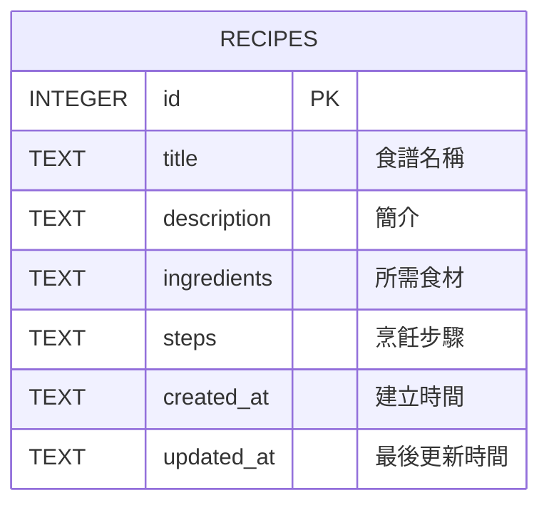

# DB Design Document — 資料庫設計文件

## 1. ER 圖



## 2. 資料表詳細說明

### `recipes` 資料表
本系統採用單一資料表設計以符合 MVP 需求，各欄位詳細定義如下：

| 欄位名稱 | 型別 | 必填 | 說明 |
| --- | --- | --- | --- |
| `id` | `INTEGER` | 是 | Primary Key, 自動遞增 (AUTOINCREMENT)。 |
| `title` | `TEXT` | 是 | 食譜名稱。 |
| `description` | `TEXT` | 否 | 食譜的簡單介紹。 |
| `ingredients` | `TEXT` | 是 | 食譜的所需食材，為求簡便與彈性，儲存為純文字 (可依照換行或逗點分隔)。未來依食材推薦將利用 `LIKE` 查詢運算實作。 |
| `steps` | `TEXT` | 是 | 烹飪步驟，儲存為純文字即可。 |
| `created_at` | `TEXT` | 是 | 建立時間，使用 `CURRENT_TIMESTAMP` 的 ISO 格式儲存。 |
| `updated_at` | `TEXT` | 是 | 最後更新時間，編輯資料時觸發更新。 |

## 3. SQL 建表語法

實作的 SQL 建表存放於 `database/schema.sql` 中：

```sql
CREATE TABLE IF NOT EXISTS recipes (
    id INTEGER PRIMARY KEY AUTOINCREMENT,
    title TEXT NOT NULL,
    description TEXT,
    ingredients TEXT NOT NULL,
    steps TEXT NOT NULL,
    created_at TEXT DEFAULT CURRENT_TIMESTAMP,
    updated_at TEXT DEFAULT CURRENT_TIMESTAMP
);
```

## 4. Python Model

封裝的檔案位於 `app/models/recipe.py`。
使用內建的 `sqlite3` 操作 `instance/database.db`，並支援：
- `create(data)`
- `get_all(query=None)`: 實作按標題與食材進行簡單字串 `LIKE` 搜尋。
- `get_by_id(recipe_id)`
- `update(recipe_id, data)`
- `delete(recipe_id)`
