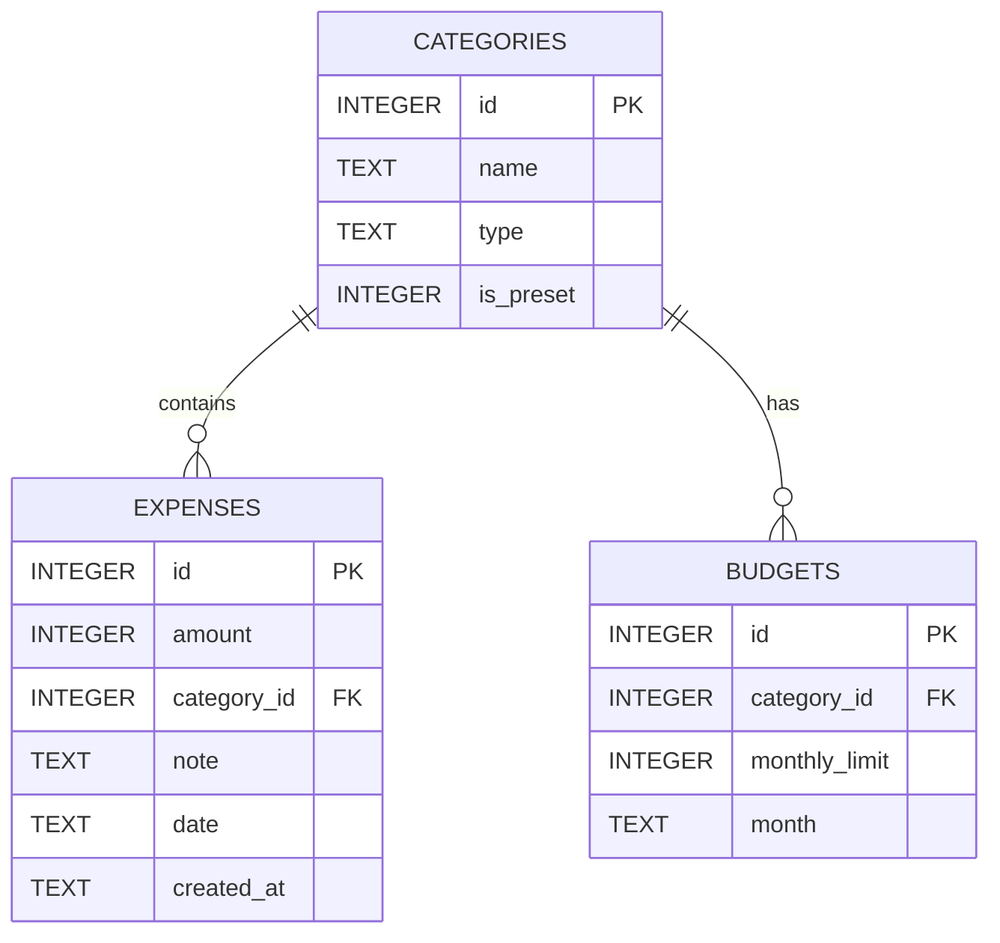

# 資料庫設計文件 (DB Design)

## 1. ER 圖 (實體關係圖)

## 2. 資料表詳細說明

### CATEGORIES (分類資料表)
負責儲存收支的類別（例如：飲食、交通、薪資等），包含系統預設分類與使用者自訂分類。
- `id` (INTEGER): Primary Key，自動遞增。
- `name` (TEXT): 分類名稱，必填。
- `type` (TEXT): 收支類型，限定為 `'income'` (收入) 或 `'expense'` (支出)，必填。
- `is_preset` (INTEGER): 判斷是否為預設分類，`1` 為預設，`0` 為使用者自訂。預設值為 `1`。

### EXPENSES (收支紀錄表)
儲存每一筆記帳明細，是最核心的交易紀錄表。
- `id` (INTEGER): Primary Key，自動遞增。
- `amount` (INTEGER): 交易金額，必填。
- `category_id` (INTEGER): Foreign Key，對應 `categories.id`，必填。
- `note` (TEXT): 消費備註與說明文字，選填。
- `date` (TEXT): 交易發生日期，格式為 `YYYY-MM-DD`，必填。
- `created_at` (TEXT): 該筆資料寫入系統的時間戳記 (ISO 格式)，必填。

### BUDGETS (預算設定表)
因應 Nice to Have 需求所規劃的各分類月預算設定。
- `id` (INTEGER): Primary Key，自動遞增。
- `category_id` (INTEGER): Foreign Key，對應 `categories.id`，必填。
- `monthly_limit` (INTEGER): 設定的該月預算金額上限，必填。
- `month` (TEXT): 對應的月份，格式為 `YYYY-MM`，必填。

## 3. SQL 建表語法與位置
完整的 SQLite CREATE 語法以及預設值的 INSERT 腳本，已產出並儲存於專案內部的 `database/schema.sql` 檔案中。

## 4. Python Model 實作
後端以 Python `sqlite3` 提供單純且高效的連線存取：
- **`app/models/db.py`**: 提供統一的 `get_db()` 資料庫連線函式，並負責處理資料庫初始化 (`init_db`)。
- **`app/models/category.py`**: 分類模型的 CRUD。
- **`app/models/expense.py`**: 紀錄模型的 CRUD，包含合併分類查詢的 JOIN 指令。
