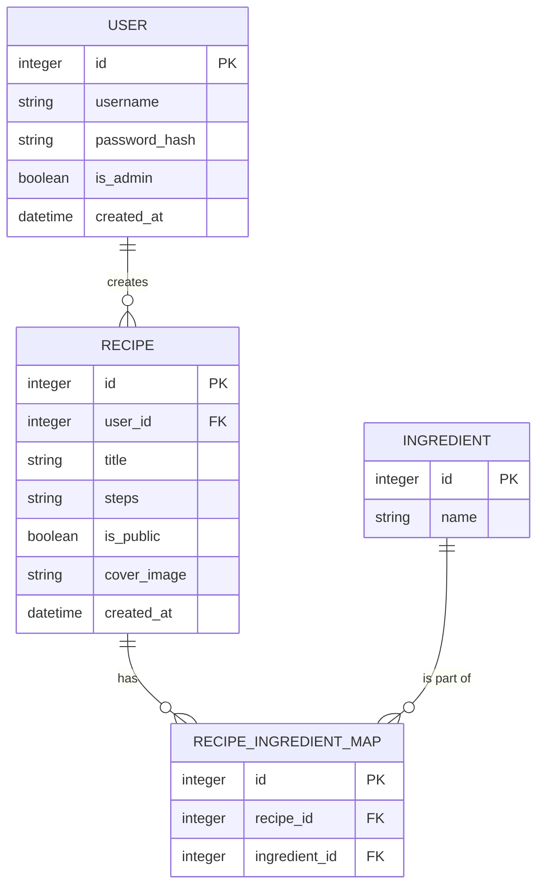

# 資料庫設計文件 (DB_DESIGN)

## 1. ER 圖

## 2. 資料表詳細說明

### 2.1 USER (使用者表)
紀錄註冊會員的資訊。
- `id`: INTEGER, Primary Key, 自動遞增。
- `username`: TEXT, 必填, 唯一, 使用者的登入帳號或信箱。
- `password_hash`: TEXT, 必填, 儲存 bcrypt 加密後的密碼。
- `is_admin`: INTEGER, 區分是否為管理員 (0: 否, 1: 是)，預設為 0。
- `created_at`: TEXT, 帳號建立時間 (ISO 8601 格式)。

### 2.2 RECIPE (食譜表)
紀錄食譜的主要資訊，關聯至建立該食譜的使用者。
- `id`: INTEGER, Primary Key, 自動遞增。
- `user_id`: INTEGER, Foreign Key (對應 USER.id)，必填，表示建立者。
- `title`: TEXT, 必填，食譜名稱。
- `steps`: TEXT, 必填，料理步驟說明。
- `is_public`: INTEGER, 是否公開 (0: 私密, 1: 公開)，預設為 0。
- `cover_image`: TEXT, 封面圖片的檔案路徑 (可為 Null)。
- `created_at`: TEXT, 食譜建立時間 (ISO 8601 格式)。

### 2.3 INGREDIENT (食材表)
全域的食材清單，避免重複的食材名稱。
- `id`: INTEGER, Primary Key, 自動遞增。
- `name`: TEXT, 必填, 唯一，食材名稱 (例如: "番茄", "雞蛋")。

### 2.4 RECIPE_INGREDIENT_MAP (食譜食材關聯表)
處理食譜與食材的「多對多 (Many-to-Many)」關係。
- `id`: INTEGER, Primary Key, 自動遞增。
- `recipe_id`: INTEGER, Foreign Key (對應 RECIPE.id)，必填。
- `ingredient_id`: INTEGER, Foreign Key (對應 INGREDIENT.id)，必填。

## 3. SQL 建表語法
存放於 `database/schema.sql`，提供直接產生上述資料表的語法。

## 4. Python Model 程式碼
存放於 `app/models/`，採用 `sqlite3` 原生套件實作。
- `app/models/database.py`: 共用的資料庫連線獲取與初始化與法。
- `app/models/user.py`: 處理使用者的 CRUD。
- `app/models/recipe.py`: 處理食譜的 CRUD。
- `app/models/ingredient.py`: 處理食材庫與食譜食材映射關係的 CRUD。
