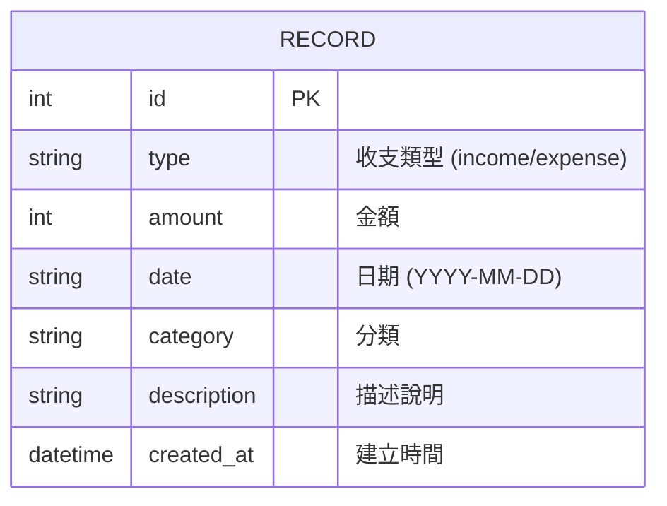

# 資料庫設計文件 (DB Design)

## 1. ER 圖（實體關係圖）

## 2. 資料表詳細說明

### `records` (收支紀錄表)

主要用於儲存使用者的每一筆收入與支出明細。

| 欄位名稱 | 型別 | 必填 | 說明 |
| :--- | :--- | :--- | :--- |
| `id` | INTEGER | 是 | Primary Key，自動遞增 |
| `type` | TEXT | 是 | 收支類型，僅允許 `'income'` (收入) 或 `'expense'` (支出) |
| `amount` | INTEGER | 是 | 金額 (為求簡化，此處使用整數儲存) |
| `date` | TEXT | 是 | 發生日期，格式為 `YYYY-MM-DD` |
| `category` | TEXT | 否 | 紀錄分類，例如：飲食、交通、薪水 |
| `description` | TEXT | 否 | 額外的描述與備註 |
| `created_at` | DATETIME| 是 | 系統建立時間，預設為 `CURRENT_TIMESTAMP` |

## 3. SQL 建表語法

建表語法請參考專案根目錄下的 `database/schema.sql` 檔案。

## 4. Python Model 程式碼

本專案依據架構設計，使用內建的 `sqlite3` 模組搭配 Parameterized Query 實作 CRUD 操作，以確保輕量化且有效防範 SQL Injection。

對應的 Python Model 程式碼請參考 `app/models/record.py`。
