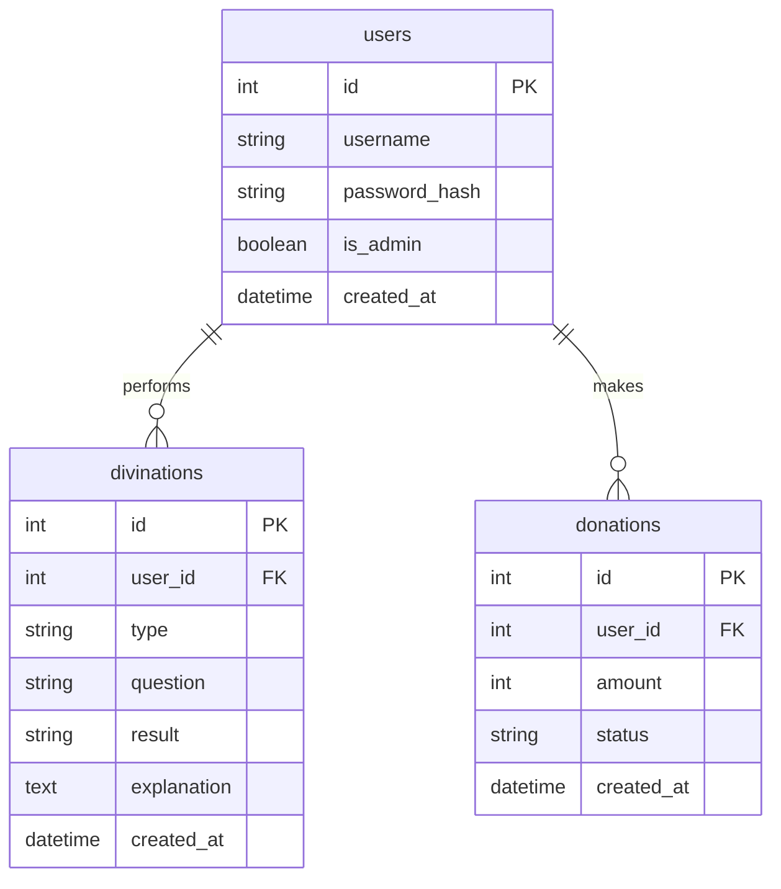

# 祈福與算命占卜系統 - 資料庫設計 (Database Design)

## 1. 實體關聯圖 (ER Diagram)

## 2. 資料表定義 (Table Definitions)

### 2.1 users (使用者表)
| 欄位名稱 (Field) | 資料型別 (Type) | 約束條件 (Constraints) | 說明 (Description) |
|---|---|---|---|
| id | INTEGER | PRIMARY KEY AUTOINCREMENT | 使用者唯一識別碼 |
| username | TEXT | UNIQUE, NOT NULL | 登入帳號或信箱 |
| password_hash | TEXT | NOT NULL | 加密後的密碼 |
| is_admin | INTEGER | DEFAULT 0 | 系統管理員標記 |
| created_at | DATETIME | DEFAULT CURRENT_TIMESTAMP | 註冊時間 |

### 2.2 divinations (占卜紀錄表)
| 欄位名稱 (Field) | 資料型別 (Type) | 約束條件 (Constraints) | 說明 (Description) |
|---|---|---|---|
| id | INTEGER | PRIMARY KEY AUTOINCREMENT | 紀錄唯一識別碼 |
| user_id | INTEGER | FOREIGN KEY (users.id) | 建立紀錄的使用者 ID |
| type | TEXT | NOT NULL | 占卜類型 (如：'temple', 'tarot') |
| question | TEXT | NOT NULL | 詢問的事項/問題 |
| result | TEXT | NOT NULL | 抽出來的結果（例如：第23籤、力量牌正位） |
| explanation | TEXT | | 系統回傳的籤詩解析或占卜詳解 |
| created_at | DATETIME | DEFAULT CURRENT_TIMESTAMP | 占卜時間 |

### 2.3 donations (香油錢隨喜紀錄表)
| 欄位名稱 (Field) | 資料型別 (Type) | 約束條件 (Constraints) | 說明 (Description) |
|---|---|---|---|
| id | INTEGER | PRIMARY KEY AUTOINCREMENT | 捐款紀錄唯一識別碼 |
| user_id | INTEGER | FOREIGN KEY (users.id) | 捐款的使用者 ID |
| amount | INTEGER | NOT NULL | 隨喜金額 |
| status | TEXT | DEFAULT 'completed' | 交易狀態字串 |
| created_at | DATETIME | DEFAULT CURRENT_TIMESTAMP | 交易時間 |
