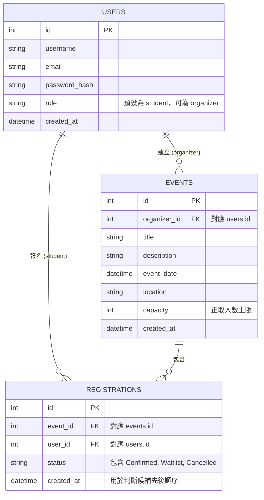

# 資料庫設計文件 (DB Design)：活動報名系統

## 1. ER 圖 (實體關係圖)

以下圖表展示本系統中各個資料表的結構及其關聯性：

## 2. 資料表詳細說明

### USERS (使用者表)
儲存所有學生與主辦方的帳號資訊，包含身份權限控制。
*   `id` (INTEGER): 主鍵，自動遞增。
*   `username` (VARCHAR): 必填，使用者的顯示名稱。
*   `email` (VARCHAR): 必填，登入用的帳號，具唯一性 (UNIQUE)。
*   `password_hash` (VARCHAR): 必填，加密儲存的密碼。
*   `role` (VARCHAR): 必填，預設為 `student`（學生）。有建立活動權限之帳號則設為 `organizer`（主辦方）。
*   `created_at` (DATETIME): 帳號建立時間。

### EVENTS (活動表)
儲存所有活動的基本資訊，每一筆記錄代表一個開放報名的活動。
*   `id` (INTEGER): 主鍵，自動遞增。
*   `organizer_id` (INTEGER): 外鍵 (Foreign Key)，對應 `users.id`，指明此活動由哪位主辦方建立。
*   `title` (VARCHAR): 必填，活動標題。
*   `description` (TEXT): 活動的詳細說明，不限長度。
*   `event_date` (DATETIME): 必填，活動預期舉辦的時間。
*   `location` (VARCHAR): 必填，活動地點。
*   `capacity` (INTEGER): 必填，設定該活動的正取名額上限。
*   `created_at` (DATETIME): 活動建立時間。

### REGISTRATIONS (報名紀錄表)
追蹤每個使用者報名各個活動的紀錄，這是處理「自動候補機制」的核心模型。
*   `id` (INTEGER): 主鍵，自動遞增。
*   `event_id` (INTEGER): 外鍵 (Foreign Key)，對應 `events.id`。
*   `user_id` (INTEGER): 外鍵 (Foreign Key)，對應 `users.id`。
*   `status` (VARCHAR): 必填，紀錄當前報名狀態。可為 `Confirmed` (正取)、`Waitlist` (候補)、`Cancelled` (已取消)。
*   `created_at` (DATETIME): 報名送出時間，時間越早代表順位越靠前，用於自動遞補時判定候補順序。
