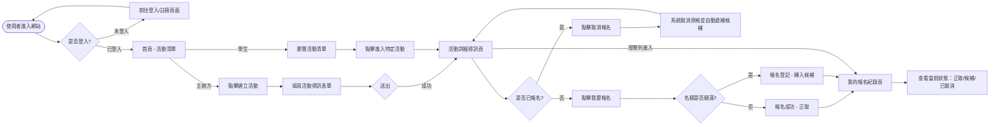
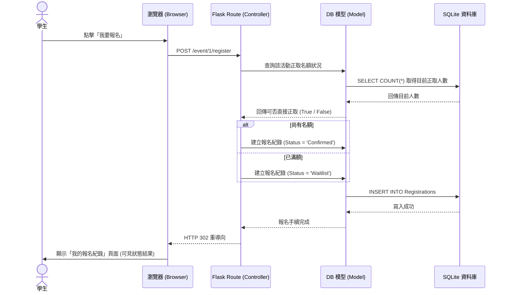

# 流程圖文件 (Flowchart)：活動報名系統

## 1. 使用者流程圖 (User Flow)

這個流程圖展示了「學生」與「主辦方」兩種角色在系統中的主要操作路徑。

## 2. 系統序列圖 (Sequence Diagram)

這張圖展示了本系統最核心的機制：「**學生報名活動及自動判定候補**」的資料流向。

## 3. 功能清單對照表

本表列出系統主要功能對應的 URL 路徑與 HTTP 方法，作為後續實作路由 (Routes) 的參考：

| 功能項目 | HTTP 方法 | URL 路徑 | 功能說明 |
| :--- | :--- | :--- | :--- |
| **首頁 / 活動列表** | GET | `/` | 顯示所有開放中的活動清單 |
| **使用者登入** | GET / POST | `/login` | 顯示登入表單與執行登入認證 |
| **使用者註冊** | GET / POST | `/register` | 顯示註冊表單與建立新帳號 |
| **建立活動表單** | GET | `/event/create` | 顯示新增活動的頁面 (需主辦方權限) |
| **送出建立活動** | POST | `/event/create` | 接收資料並將新活動寫入 SQLite |
| **活動詳細資訊** | GET | `/event/<event_id>` | 顯示特定活動的詳細內容與報名人數 |
| **報名活動** | POST | `/event/<event_id>/register` | 執行報名邏輯，系統自動判定正取或候補 |
| **取消報名** | POST | `/event/<event_id>/cancel` | 取消報名，系統將自動依序遞補候補者 |
| **報名紀錄查詢** | GET | `/my_registrations` | 查詢登入者所有報名過的活動與目前狀態 |
| **登出** | POST | `/logout` | 清除 Session 並登出當前帳號 |
