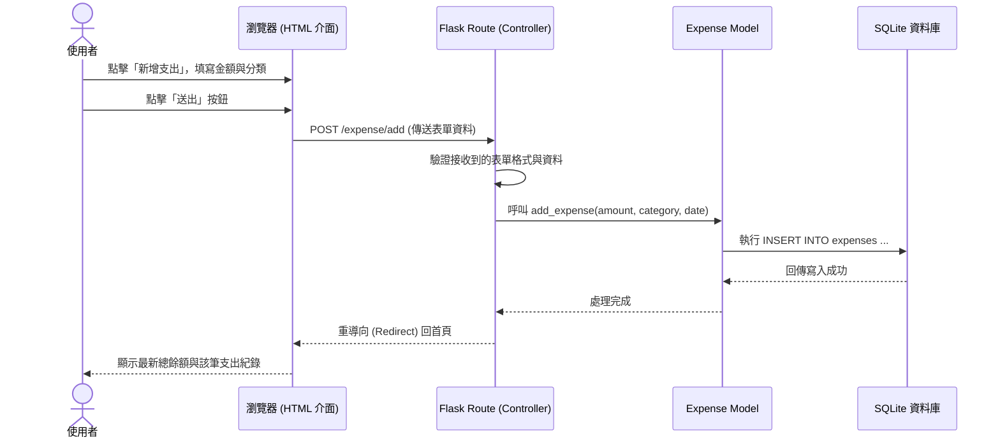

# 流程圖設計文件 (Flowcharts) - 個人記帳簿系統

本文件基於 PRD 的需求與架構設計，展示系統的「使用者流程」與「系統序列流程」，以協助視覺化系統運作方式。

## 1. 使用者流程圖 (User Flow)

描述使用者進入系統後，可能進行的各項操作路徑。

```mermaid
flowchart LR
    Start([使用者開啟網頁]) --> Home[首頁 - 儀表板\n(顯示目前總餘額)]
    
    Home --> Action{要執行什麼操作？}
    
    Action -->|新增收支| AddSelect[選擇新增收入或支出]
    AddSelect -->|輸入金額與分類| FillForm[填寫資料表單]
    FillForm --> SubmitAdd[送出儲存]
    SubmitAdd --> Home
    
    Action -->|查詢或篩選| Records[進入歷史收支紀錄頁面]
    Records -->|選擇時間區間| Filter[套用日期或月份條件]
    Filter --> ShowResult[顯示篩選後的收支結果列表]
    ShowResult --> Home
    
    Action -->|管理固定扣款| Fixed[進入固定扣款設定頁]
    Fixed -->|新增固定扣款| AddFixed[填寫每月固定扣款項目]
    AddFixed --> Home
```

---

## 2. 系統序列圖 (System Sequence Diagram)

以下以「使用者操作新增一筆支出」為例，展示前端瀏覽器、Flask 路由、Model 與 SQLite 資料庫之間的互動流程。



---

## 3. 功能清單對照表

整理未來需要實作的路由對應表，作為之後 API 設計或模板實作的參考依據。

| 功能名稱 | 說明 | URL 路徑 | HTTP 動作 |
| --- | --- | --- | --- |
| **首頁與總餘額** | 顯示當前可用餘額與最近幾筆收支紀錄，若有跨月狀況，載入時負責觸發自動建立固定扣款。 | `/` | `GET` |
| **新增收入頁面** | 渲染新增收入的表單畫面。 | `/income/add` | `GET` |
| **處理新增收入** | 處理表單送出的收入資料，寫入後重導至首頁。 | `/income/add` | `POST` |
| **新增支出頁面** | 渲染新增支出的表單畫面。 | `/expense/add` | `GET` |
| **處理新增支出** | 處理表單送出的支出資料，寫入後重導至首頁。 | `/expense/add` | `POST` |
| **收支查詢清單** | 顯示所有紀錄，支援讀取 URL query 參數（如 `?start_date=xxx`）來過濾特定區間。 | `/records` | `GET` |
| **固定扣款設定頁** | 顯示與管理每月的固定扣款項目。 | `/fixed-deduction` | `GET` |
| **新增固定扣款** | 處理表單送出的固定扣款資料。 | `/fixed-deduction` | `POST` |
