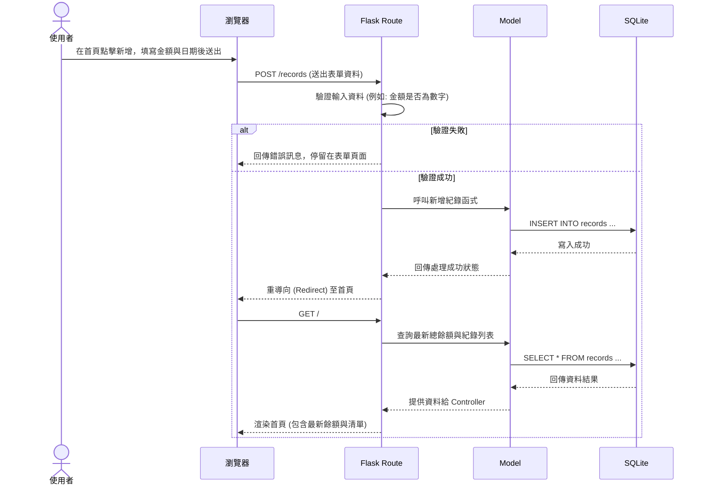

# 流程圖文件 (Flowchart)

根據產品需求文件 (PRD) 與系統架構文件 (Architecture)，以下為個人記帳簿系統的使用者流程圖、系統序列圖與功能清單對照表。

## 1. 使用者流程圖 (User Flow)

此流程圖描述使用者從進入網站開始，在各個主要功能之間的操作路徑。

```mermaid
flowchart LR
    A([使用者開啟網頁]) --> B[首頁 - 總餘額與收支紀錄列表]
    B --> C{要執行什麼操作？}
    
    C -->|新增紀錄| D[點擊新增按鈕]
    D --> E[填寫收支表單 (金額、日期、分類、描述)]
    E -->|提交| F{資料驗證}
    F -->|成功| B
    F -->|失敗| E
    
    C -->|管理紀錄| G[選擇單筆收支紀錄]
    G --> H{選擇動作}
    H -->|編輯| I[進入編輯模式/表單]
    I -->|儲存| B
    H -->|刪除| J[確認刪除視窗]
    J -->|確認| B
```

## 2. 系統序列圖 (Sequence Diagram)

此序列圖描述「使用者新增一筆收支紀錄」時，系統各元件之間的詳細互動流程。



## 3. 功能清單對照表

以下為各項功能對應的 URL 路徑與 HTTP 請求方法規劃：

| 功能名稱 | URL 路徑 | HTTP 方法 | 說明 |
| :--- | :--- | :--- | :--- |
| **瀏覽首頁 (餘額與列表)** | `/` | `GET` | 顯示目前總餘額以及近期的收支歷史紀錄 |
| **新增收支紀錄頁面** | `/records/new` | `GET` | 顯示填寫收支資料的表單頁面 (如與首頁整合則可省略) |
| **送出新增紀錄** | `/records` | `POST` | 接收表單資料並寫入資料庫，完成後導回首頁 |
| **編輯收支紀錄頁面** | `/records/<id>/edit`| `GET` | 顯示帶有原始資料的編輯表單頁面 |
| **更新收支紀錄** | `/records/<id>` | `POST` (或 PUT)| 接收更新資料並寫入資料庫，完成後導回首頁 |
| **刪除收支紀錄** | `/records/<id>/delete`| `POST` (或 DELETE)| 將指定 ID 的收支紀錄從資料庫中刪除 |

> 備註：因為傳統 HTML 表單僅支援 GET 與 POST，編輯與刪除的送出動作常透過 `POST` 方法加上路徑來實作。
