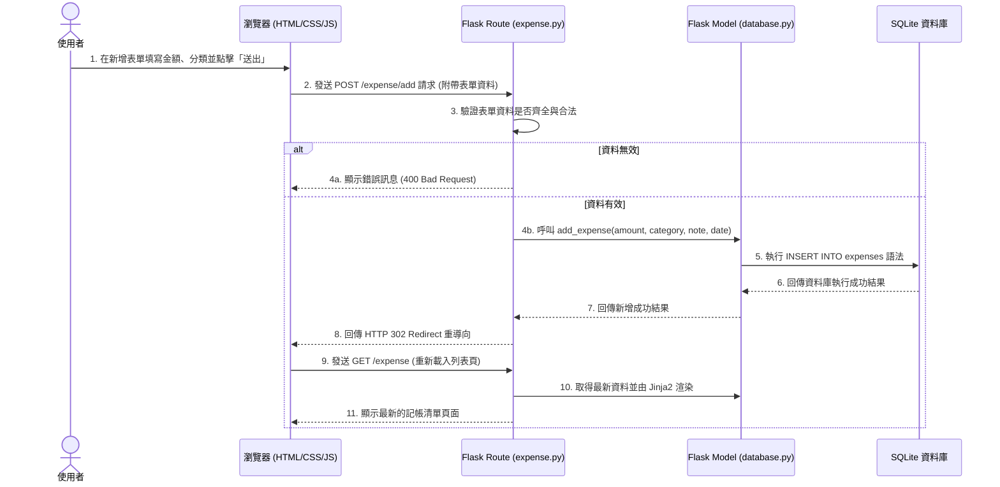

# 流程圖文件 (Flowchart)

## 專案名稱：個人記帳簿 (Personal Expense Tracker)

### 1. 使用者流程圖 (User Flow)

此流程圖展示使用者進入「個人記帳簿」系統後，所能進行的操作路徑，包含瀏覽總覽、新增收支紀錄、編輯與刪除等核心功能。

```mermaid
flowchart LR
    A([使用者造訪首頁]) --> B[首頁 - 財務總覽 (Dashboard)]
    
    B --> C{要執行什麼操作？}
    
    C -->|查看明細| D[記帳紀錄清單頁 (瀏覽所有的收支明細)]
    C -->|新增紀錄| E[新增收支頁面 (填寫表單)]
    
    D -->|點擊編輯| F[編輯收支頁面 (修改表單)]
    D -->|點擊刪除| G[確認刪除視窗]
    
    E -->|送出表單| H((儲存成功))
    F -->|送出修改| H
    G -->|確認| I((刪除成功))
    
    H -->|自動重導向| D
    I -->|自動重導向| D
    D -->|返回| B
```

---

### 2. 系統序列圖 (Sequence Diagram)

此序列圖描述「使用者點擊新增一筆記帳紀錄」到「資料被寫入 SQLite 並重新顯示列表」的完整系統流轉過程。



---

### 3. 功能清單與 API 對照表 (Routes & Endpoint Mapping)

根據在架構中所定義的 Flask Routes，各功能的預期存取路徑與對應 HTTP 方法如下：

| 功能描述 | 模組 (Route) | HTTP 方法 | URL 路徑 (Endpoint) | 返回操作 (Response) |
| --- | --- | --- | --- | --- |
| **首頁：財務總覽** | index.py | `GET` | `/` | 回傳 `index.html` (含統計圖表) |
| **收支清單：檢視所有紀錄** | expense.py | `GET` | `/expense` | 回傳 `expense_list.html` |
| **新增紀錄：顯示表單** | expense.py | `GET` | `/expense/add` | 回傳 `expense_form.html` (供填寫) |
| **新增紀錄：送出資料** | expense.py | `POST` | `/expense/add` | 資料庫 INSERT，重導向至 `/expense` |
| **編輯紀錄：顯示表單** | expense.py | `GET` | `/expense/edit/<id>` | 回傳 `expense_form.html` (帶入原資料)|
| **編輯紀錄：送出修改** | expense.py | `POST` | `/expense/edit/<id>` | 資料庫 UPDATE，重導向至 `/expense` |
| **刪除紀錄：送出刪除** | expense.py | `POST` | `/expense/delete/<id>`| 資料庫 DELETE，重導向至 `/expense` |

> **備註**：由於一般的 HTML `<form>` 只能使用 GET 與 POST，因此刪除與修改送出暫時不使用 RESTful 嚴格定義的 `PUT`/`DELETE`，而統一使用 `POST`。
