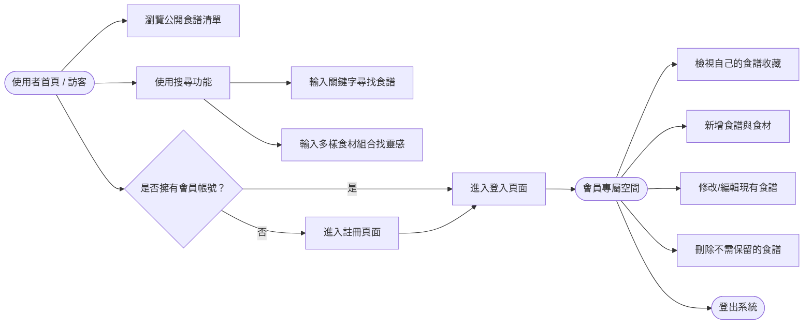
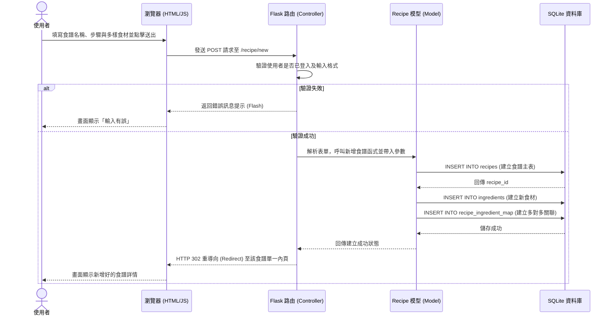

# 系統與使用者流程圖 (FLOWCHART) - 食譜收藏夾系統

本文件依據 [PRD.md](./PRD.md) 和 [ARCHITECTURE.md](./ARCHITECTURE.md) 的規格，繪製「使用者流程圖」與「系統序列圖」，並整理出「功能清單對照表」，以視覺化方式呈現系統藍圖。

## 1. 使用者流程圖 (User Flow)

此流程圖展示使用者進入系統後的各種操作路徑，包含瀏覽、搜尋、註冊登入及食譜管理等行為。

## 2. 系統序列圖 (Sequence Diagram)

以下序列圖以「**使用者新增食譜**」這項核心功能為例，展示資料由前端傳遞至後端進行處理並儲存的完整步驟。

## 3. 功能清單對照表

此表格列出本專案核心功能與對應的 URL 設計、HTTP 方法。此設計遵守了 RESTful 精神與本專案的 Blueprint 拆分原則。

| 功能區塊 | 功能名稱 | URL 路徑 | HTTP 方法 | 備註說明 |
| :--- | :--- | :--- | :--- | :--- |
| **公開瀏覽** | 首頁 (最新食譜列表) | `/` | GET | 訪客不需登入即可觀看 |
| | 檢視食譜詳細內容 | `/recipe/<id>` | GET | 顯示食譜做法與配料 |
| | 關鍵字搜尋食譜 | `/search` | GET | 帶入查詢參數 `?q=xxx` |
| | 食材組合搜尋推薦 | `/search/ingredients` | GET | 帶入查詢參數 `?items=蛋,番茄` |
| **會員認證** | 註冊新帳號 | `/auth/register` | GET, POST | GET 取表單，POST 動作 |
| | 會員登入 | `/auth/login` | GET, POST | |
| | 會員登出 | `/auth/logout` | GET | 登出並清除 Session |
| **食譜管理** | 檢視個人專屬食譜區 | `/recipe/my` | GET | 需登入，列出該會員所建食譜 |
| | 新增食譜 | `/recipe/new` | GET, POST | 需登入，填寫各種欄位 |
| | 編輯食譜 | `/recipe/<id>/edit` | GET, POST | 只能修改自己名下的食譜 |
| | 刪除食譜 | `/recipe/<id>/delete`| POST | 同上，透過獨立 POST 接口防誤刪 |
| **系統管理** | 後台資料全覽 | `/admin` | GET | 僅限特定身分存取 (Admin) |
| | 強制下架違規食譜 | `/admin/recipe/<id>/delete` | POST | 系統管理員專屬權限 |
